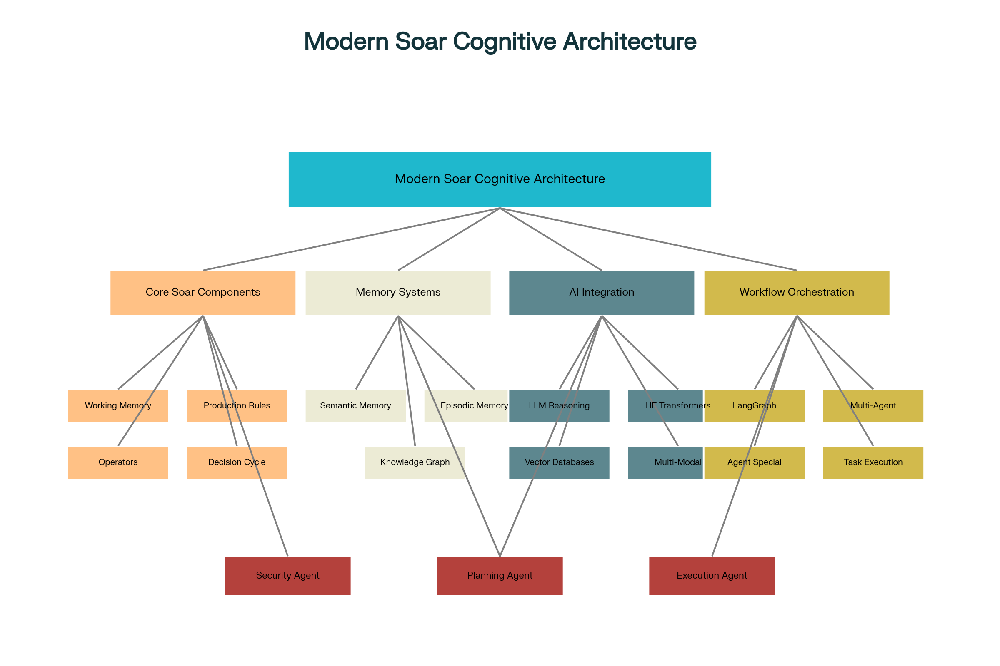
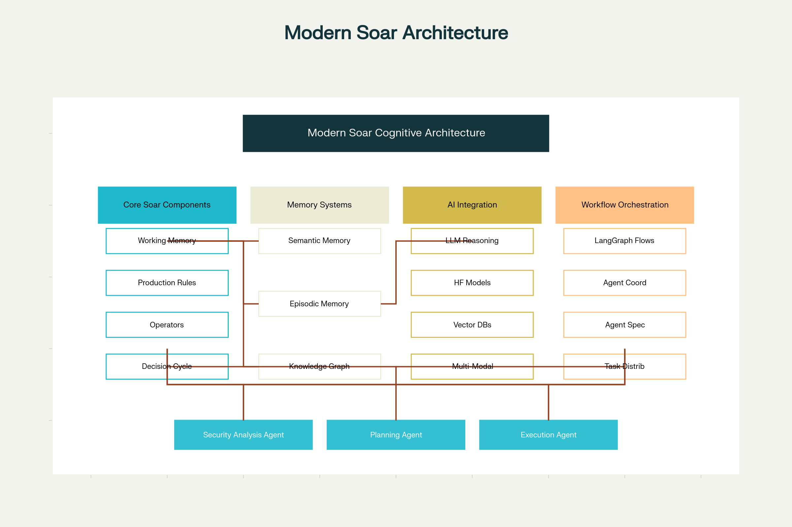

# Modern Soar Cognitive Architecture Implementation

A comprehensive implementation of the Soar cognitive architecture integrated with modern AI tools including LangChain, LangGraph, Hugging Face Transformers, and vector databases.

## Overview

This implementation transforms the traditional Soar cognitive architecture into a modern agentic AI system capable of:

- Multi-agent collaboration and workflows
- Natural language instruction processing
- Vector-based memory systems
- LLM-enhanced reasoning and decision making
- Multi-modal AI processing
- Knowledge graph integration
- Real-time incident response and learning

## Architecture Components



### Core Soar Components

1. **SoarState**: Working memory representation with attributes, objects, and operators
2. **SoarOperator**: Operators with preferences, conditions, and actions
3. **ProductionRule**: If-then rules for procedural knowledge
4. **Decision Cycle**: Enhanced cycle with LLM integration

### Modern AI Integration

1. **LLM Integration**: Natural language processing and reasoning
2. **Vector Databases**: Semantic similarity search and retrieval
3. **Knowledge Graphs**: Structured relationship modeling
4. **Multi-modal Processing**: Text, vision, and audio integration
5. **Agent Orchestration**: LangGraph-style workflow management

### Memory Systems

1. **Semantic Memory**: Vector-enhanced knowledge storage
2. **Episodic Memory**: Experience storage with temporal indexing
3. **Working Memory**: Current state and active information
4. **Procedural Memory**: Production rules and operators



## Installation

Check requirements from requirements.txt

```python
pip install requirements.txt
```

```bash
# Core dependencies
pip install numpy pandas
pip install langchain langchain-community
pip install transformers torch
pip install chromadb  # or pinecone-client, weaviate-client
pip install networkx  # for knowledge graphs

# Optional: For full LangGraph support
pip install langgraph langsmith

# Optional: For advanced vector databases
pip install faiss-cpu  # or faiss-gpu
pip install sentence-transformers
```

## Quick Start

Modern soar module is located at modern-soar/modern-soar.py

```python
from modern_soar import ModernSoarSystem, SoarAgent, CyberSecurityWorkflow

# Initialize the system
system = ModernSoarSystem()
system.initialize_cybersecurity_domain()

# Create a specialized agent
agent = SoarAgent("security_analyst", "analysis")

# Process an incident
incident_data = {
    "type": "malware_detection",
    "description": "Suspicious executable detected",
    "network_data": "malicious connections observed"
}

result = await system.process_incident(incident_data)
print(f"Processed incident: {result['incident_id']}")
```

## Detailed Implementation

### 1. Core Soar Architecture

The implementation maintains compatibility with traditional Soar concepts while adding modern AI capabilities:

```python
class SoarAgent:
    def __init__(self, agent_id: str, specialization: str = "general"):
        # Core Soar components
        self.working_memory = SoarState()
        self.procedural_memory = []
        self.semantic_memory = SemanticMemory()
        self.episodic_memory = EpisodicMemory()
        
        # AI Integration
        self.llm = ChatOpenAI(model="gpt-4")
        self.vector_db = ChromaDB()
        self.tools = {}
```

### 2. Natural Language Processing

Convert natural language instructions to Soar operators:

```python
def process_natural_language_instruction(self, instruction: str):
    prompt = f"""
    Convert this instruction into Soar operators:
    {instruction}
    
    Generate:
    1. Operator name
    2. Conditions for execution
    3. Actions to perform
    """
    
    response = self.llm.generate(prompt)
    return self.parse_operators(response)
```

### 3. Multi-Agent Workflows

LangGraph-style orchestration for complex tasks:

```python
class SoarWorkflowOrchestrator:
    def __init__(self):
        self.nodes = {}
        self.agents = {}
    
    async def execute_workflow(self, initial_state):
        current_node = self.start_node
        while current_node:
            state = await current_node.execute(state)
            current_node = self.get_next_node(current_node, state)
        return state
```

### 4. Enhanced Memory Systems

Vector-based semantic memory with LLM enhancement:

```python
class SemanticMemory:
    def store_knowledge(self, concept: str, description: str):
        # Store in vector database
        embedding = self.embed_text(f"{concept}: {description}")
        self.vector_db.add(embedding, metadata={
            'concept': concept,
            'description': description
        })
        
        # Update activation values
        self.activation_values[concept] += 1
```

## Real-World Integration Examples

### LangChain Integration

```python
from langchain import OpenAI, PromptTemplate
from langchain.agents import initialize_agent, Tool
from langchain.memory import ConversationBufferMemory

# Create LangChain tools for Soar agents
def create_soar_tools(agent):
    return [
        Tool(
            name="Memory_Retrieval",
            func=agent.semantic_memory.retrieve_knowledge,
            description="Retrieve relevant knowledge from memory"
        ),
        Tool(
            name="Operator_Execution", 
            func=agent.execute_operator,
            description="Execute a Soar operator"
        )
    ]

# Initialize LangChain agent with Soar integration
langchain_agent = initialize_agent(
    tools=create_soar_tools(soar_agent),
    llm=OpenAI(),
    agent="conversational-react-description",
    memory=ConversationBufferMemory()
)
```

### Hugging Face Integration

```python
from transformers import pipeline, AutoTokenizer, AutoModel

# Initialize HuggingFace pipelines
class SoarHuggingFaceIntegration:
    def __init__(self):
        self.sentiment_analyzer = pipeline("sentiment-analysis")
        self.text_generator = pipeline("text-generation", 
                                      model="gpt2")
        self.qa_system = pipeline("question-answering",
                                 model="distilbert-base-cased-distilled-squad")
    
    def enhance_decision_making(self, context: str, question: str):
        # Use QA system to enhance Soar reasoning
        result = self.qa_system(question=question, context=context)
        return result['answer']
```

### Vector Database Integration

```python
import chromadb
from sentence_transformers import SentenceTransformer

class VectorMemorySystem:
    def __init__(self):
        self.client = chromadb.Client()
        self.collection = self.client.create_collection("soar_memory")
        self.encoder = SentenceTransformer('all-MiniLM-L6-v2')
    
    def store_memory(self, text: str, metadata: dict):
        embedding = self.encoder.encode([text])
        self.collection.add(
            embeddings=embedding.tolist(),
            documents=[text],
            metadatas=[metadata],
            ids=[str(uuid.uuid4())]
        )
    
    def retrieve_similar(self, query: str, n_results: int = 5):
        query_embedding = self.encoder.encode([query])
        results = self.collection.query(
            query_embeddings=query_embedding.tolist(),
            n_results=n_results
        )
        return results
```

## Use Cases

### 1. Cybersecurity Incident Response

```python
# Specialized cybersecurity workflow
workflow = CyberSecurityWorkflow()

# Process security incident
incident = {
    "type": "malware_detection",
    "description": "Suspicious process detected",
    "indicators": ["unusual_network_traffic", "unknown_executable"]
}

result = await workflow.process_security_incident(incident)
```

### 2. Autonomous DevOps

```python
# DevOps automation workflow
devops_agent = SoarAgent("devops_agent", "automation")

# Add DevOps-specific tools
devops_agent.add_tool("deploy_service", kubernetes_deploy)
devops_agent.add_tool("monitor_health", prometheus_monitor)
devops_agent.add_tool("rollback_deployment", kubernetes_rollback)

# Process deployment request
deployment_request = "Deploy user-service v2.1 to production"
operators = devops_agent.process_natural_language_instruction(deployment_request)
```

### 3. Intelligent Customer Support

```python
# Customer support agent with knowledge base
support_agent = SoarAgent("support_agent", "assistance")

# Integrate with company knowledge base
support_agent.semantic_memory.load_knowledge_base("company_kb.json")

# Process customer query
customer_query = "How do I reset my password?"
response = support_agent.generate_response(customer_query)
```

## Advanced Features

### 1. Learning and Adaptation

```python
class AdaptiveLearning:
    def __init__(self, agent: SoarAgent):
        self.agent = agent
        self.learning_rate = 0.1
    
    def update_from_feedback(self, action: str, outcome: str, reward: float):
        # Update operator preferences based on outcomes
        for op in self.agent.working_memory.operators:
            if op.name == action:
                op.preferences["utility"] += reward * self.learning_rate
```

### 2. Federated Learning

```python
class FederatedSoarNetwork:
    def __init__(self):
        self.agents = {}
        self.shared_knowledge = SemanticMemory()
    
    def share_knowledge(self, agent_id: str, knowledge: dict):
        # Share knowledge across agent network
        self.shared_knowledge.store_knowledge(
            concept=knowledge['concept'],
            description=knowledge['description'],
            context={'source': agent_id}
        )
```

### 3. Human-in-the-Loop

```python
class HumanInTheLoop:
    def __init__(self, agent: SoarAgent):
        self.agent = agent
        self.pending_approvals = []
    
    async def request_human_approval(self, action: str, context: dict):
        approval_request = {
            'action': action,
            'context': context,
            'timestamp': time.time()
        }
        self.pending_approvals.append(approval_request)
        
        # Wait for human approval (implementation specific)
        approved = await self.wait_for_approval(approval_request)
        return approved
```

## Performance Optimization

### 1. Caching Strategies

```python
from functools import lru_cache

class OptimizedSemanticMemory(SemanticMemory):
    @lru_cache(maxsize=1000)
    def cached_retrieval(self, query_hash: str):
        # Cache frequent queries
        return self.retrieve_knowledge(query_hash)
```

### 2. Parallel Processing

```python
import asyncio
from concurrent.futures import ThreadPoolExecutor

class ParallelSoarAgent(SoarAgent):
    def __init__(self, *args, **kwargs):
        super().__init__(*args, **kwargs)
        self.executor = ThreadPoolExecutor(max_workers=4)
    
    async def parallel_rule_evaluation(self):
        # Evaluate rules in parallel
        tasks = []
        for rule in self.procedural_memory:
            task = asyncio.create_task(self.evaluate_rule_async(rule))
            tasks.append(task)
        
        results = await asyncio.gather(*tasks)
        return results
```

## Testing and Validation

### Unit Tests

```python
import unittest

class TestSoarAgent(unittest.TestCase):
    def setUp(self):
        self.agent = SoarAgent("test_agent")
    
    def test_operator_creation(self):
        instruction = "analyze network traffic"
        operators = self.agent.process_natural_language_instruction(instruction)
        self.assertGreater(len(operators), 0)
        self.assertEqual(operators[0].name, "analyze-situation")
    
    def test_memory_storage(self):
        self.agent.semantic_memory.store_knowledge(
            "test_concept", "test description"
        )
        results = self.agent.semantic_memory.retrieve_knowledge("test_concept")
        self.assertGreater(len(results), 0)
```

### Integration Tests

```python
class TestWorkflowIntegration(unittest.TestCase):
    async def test_cybersecurity_workflow(self):
        system = ModernSoarSystem()
        system.initialize_cybersecurity_domain()
        
        incident = {
            "type": "malware_detection",
            "description": "Test malware incident"
        }
        
        result = await system.process_incident(incident)
        self.assertIn("incident_id", result)
        self.assertIn("workflow_result", result)
```

## Deployment

### Docker Configuration

```dockerfile
FROM python:3.9-slim

WORKDIR /app

COPY requirements.txt .
RUN pip install -r requirements.txt

COPY . .

EXPOSE 8000

CMD ["python", "main.py"]
```

### Kubernetes Deployment

```yaml
apiVersion: apps/v1
kind: Deployment
metadata:
  name: soar-agent-deployment
spec:
  replicas: 3
  selector:
    matchLabels:
      app: soar-agent
  template:
    metadata:
      labels:
        app: soar-agent
    spec:
      containers:
      - name: soar-agent
        image: modern-soar:latest
        ports:
        - containerPort: 8000
```

## Future Enhancements

1. **Quantum-Classical Hybrid Processing**: Integration with quantum computing for optimization
2. **Neuromorphic Computing**: Hardware acceleration for cognitive processing
3. **Advanced Multi-Modal Fusion**: Enhanced cross-modal reasoning
4. **Explainable AI**: Better interpretability of agent decisions
5. **Edge Computing**: Deployment on edge devices for real-time processing

## Contributing

1. Fork the repository
2. Create feature branch (`git checkout -b feature/amazing-feature`)
3. Commit changes (`git commit -m 'Add amazing feature'`)
4. Push to branch (`git push origin feature/amazing-feature`)
5. Open a Pull Request

## License

This project is licensed under the MIT License - see the LICENSE file for details.

## Acknowledgments

- Original Soar cognitive architecture team at University of Michigan
- LangChain and LangGraph communities
- Hugging Face for transformer models
- Vector database communities (Chroma, Pinecone, Weaviate)

## References

1. Laird, J. E. (2012). The Soar Cognitive Architecture. MIT Press.
2. Rosenbloom, P. S., Laird, J. E., & Newell, A. (1993). The Soar Papers: Readings on Integrated Intelligence.
3. [LangChain Documentation](https://docs.langchain.com/)
4. [Hugging Face Transformers](https://huggingface.co/docs/transformers/)
5. Vector Database Comparison: [https://github.com/vector-databases/vector-databases](https://github.com/vector-databases/vector-databases)
